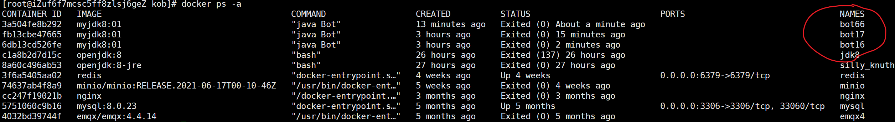
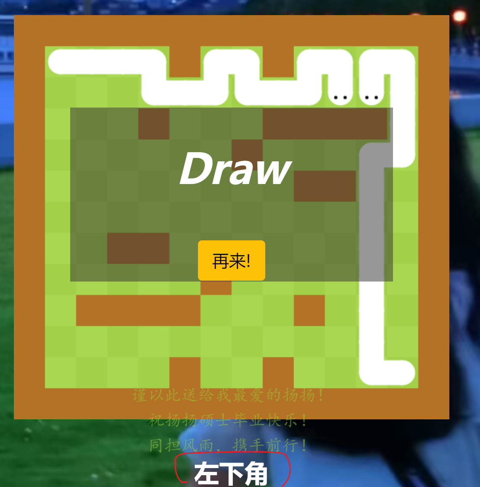
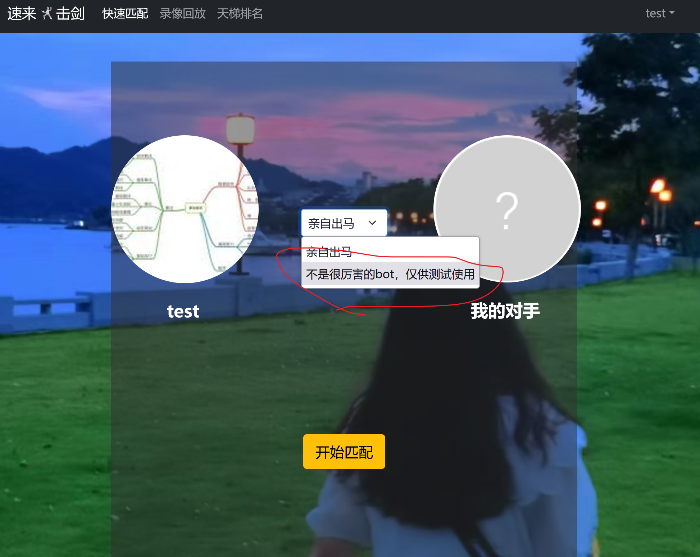

# 工程简介
**  **
## 线上地址 ：https://zjaiyy.love
## **可能是**
      全网第一个实现AI代码在Docker容器中运行的“蛇王争霸”游戏项目。有图有真相：

### 胜利目标： 
    蛇的头部撞到障碍物，或者是撞到我方/敌方蛇的身体就算输，所以您只需要保证对手的失误在您之前即可。
### 游戏玩法1： 
    手动操作：按键盘WASD操控蛇上下左右移动,游戏开始时在对战地图下方会告知您位于左下方还是右上方。

### 游戏玩法2： 
    派AI出战：请登录测试账号体验，用户名：test,密码123456，在匹配界面选择如下机器人，而您只需坐山观虎斗即可

## 注意事项
    1.请不要改动test账号的AI代码!!!
    2.如果玩家选择手动操作，请在5s内给出下一步操作，不然会判输；
    3.本项目此版本是AI代码在Docker容器中运行的第一个版本，难免会有一些bug,欢迎在issue；
    4.用户编写的AI代码必须符合一定的要求才能在本作品中运行起来，三言两语难以说清，所以暂不支持用户自己编写AI代码来代替用户出战
    

    
    

